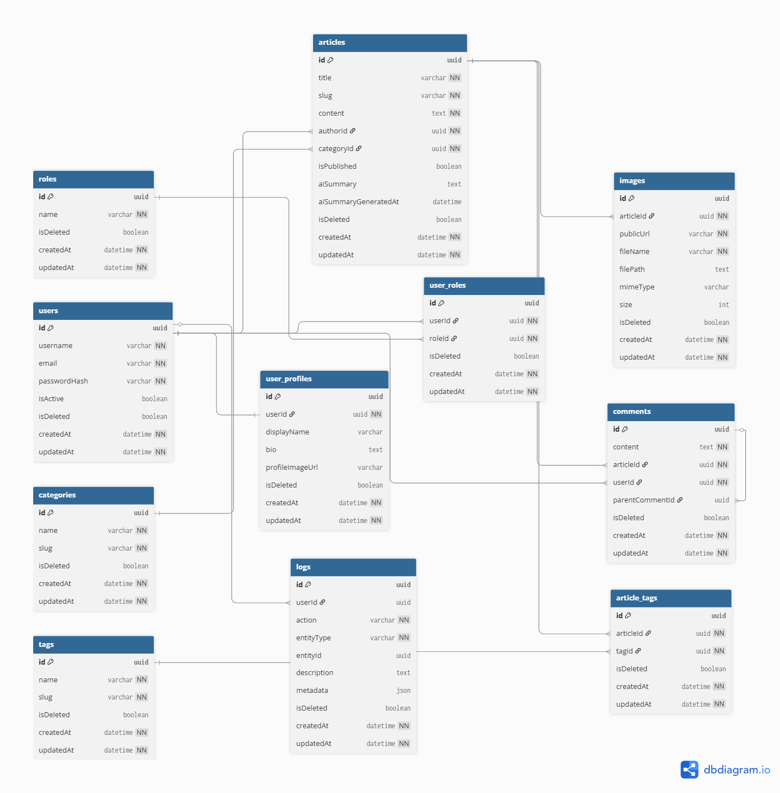
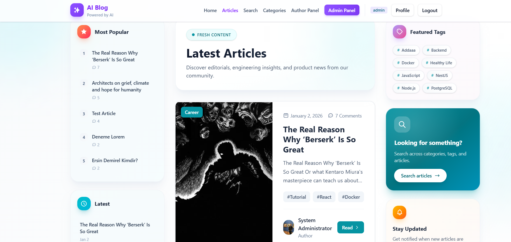
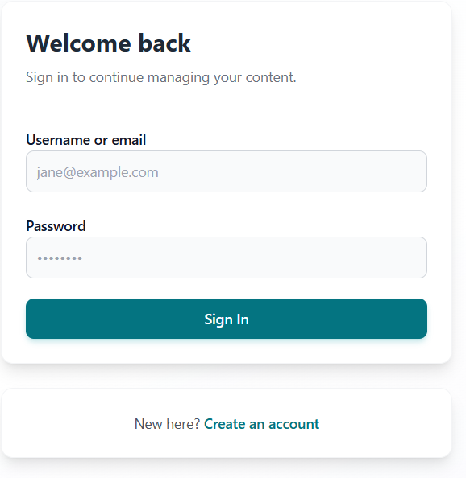
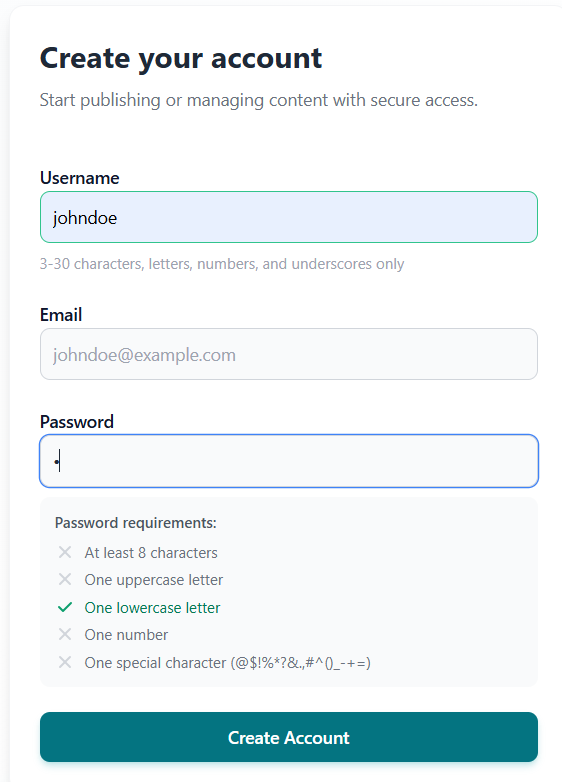
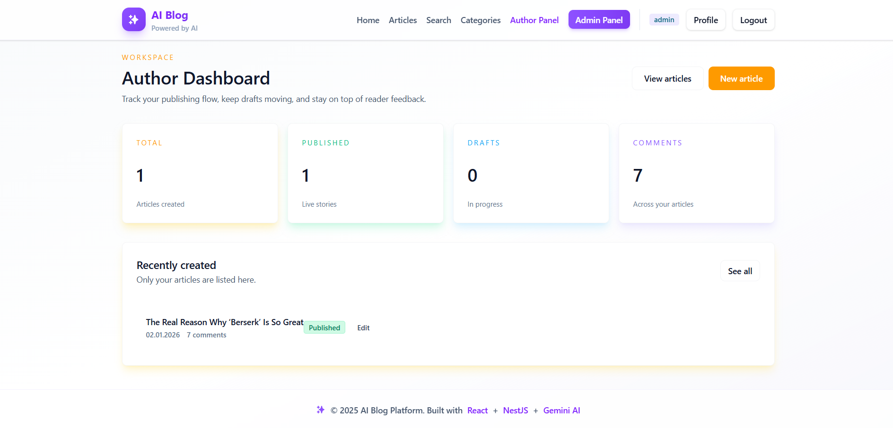
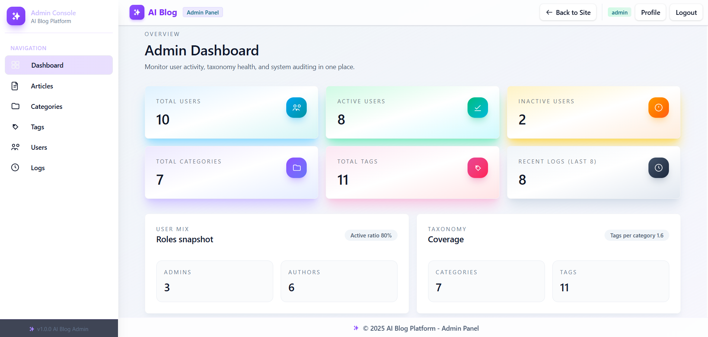
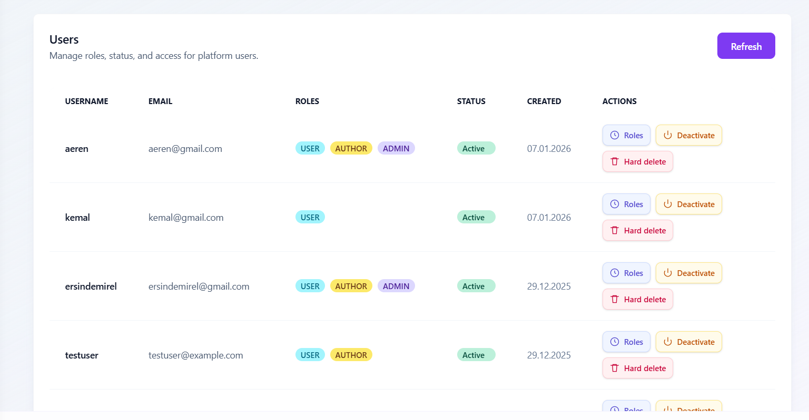
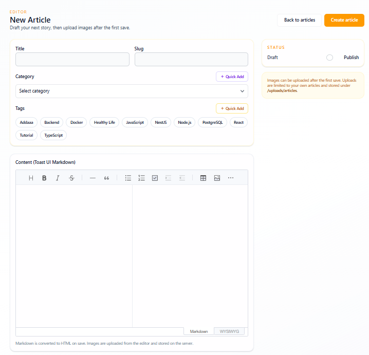
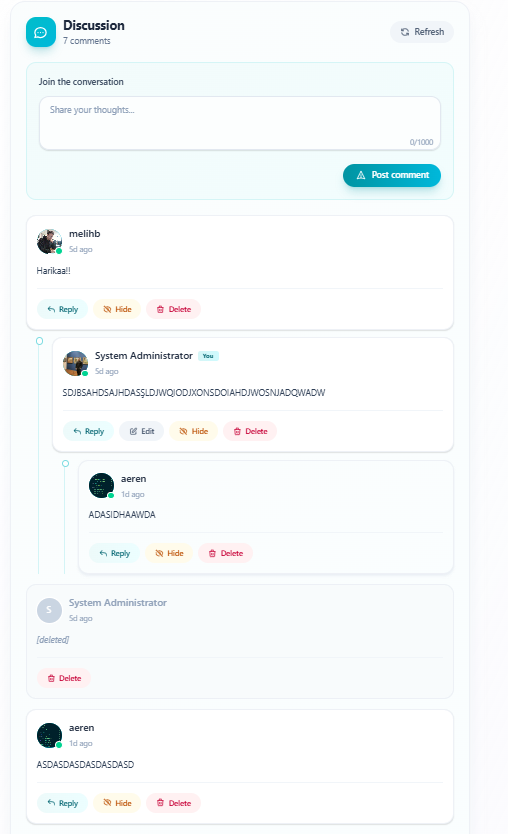
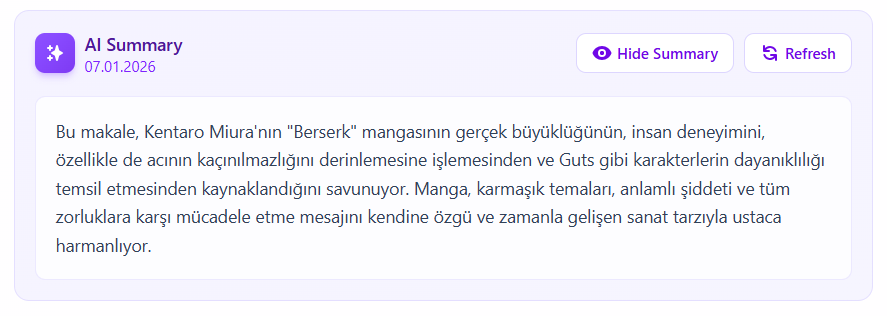

# CENG 307 Web Tabanlı Teknolojiler– 2025–2026 Güz Dönemi Final Projesi Raporu

---

## PAMUKKALE ÜNİVERSİTESİ

## MÜHENDİSLİK FAKÜLTESİ

## BİLGİSAYAR MÜHENDİSLİĞİ BÖLÜMÜ

---

### CENG 307 – Web Tabanlı Teknolojiler

### 2025–2026 Güz Dönemi Final Projesi

---

# **AI Blog Platform**

## Yapay Zeka Destekli Full-Stack Blog Uygulaması

---

**Öğrenci Adı:** Ali Eren Oğuztaş

**Öğrenci Numarası:** 22253065

**Teslim Tarihi:** 8 Ocak 2026

**Proje URL:** https://github.com/aeren23/AIIntegratedBlogWebSite

---

---

## ÖZET (ABSTRACT)

Bu proje, modern web teknolojileri kullanılarak geliştirilmiş, yapay zeka destekli tam yığın (full-stack) bir blog platformudur. Sistem, React ve TypeScript kullanılarak oluşturulmuş bir frontend ile NestJS tabanlı RESTful bir backend API'den oluşmaktadır.

Platform, çok rollü bir kullanıcı sistemi (USER, AUTHOR, ADMIN, SUPERADMIN) üzerine inşa edilmiş olup, rol tabanlı yetkilendirme ve erişim kontrolü mekanizmaları içermektedir. JWT (JSON Web Token) tabanlı kimlik doğrulama sistemi, güvenli oturum yönetimi sağlamaktadır.

Temel işlevler arasında makale oluşturma ve yönetimi, zengin metin editörü ile içerik düzenleme, hiyerarşik yorum sistemi, kategori ve etiket yönetimi, kullanıcı profil yönetimi ve yapay zeka ile otomatik makale özetleme yer almaktadır.

Hedef kullanıcılar; içerik üreticileri (yazarlar), blog okuyucuları, platform yöneticileri ve genel ziyaretçilerdir. Sistem, bulut ortamında barındırılmakta olup herkese açık erişim sunmaktadır.

---

## 1. GİRİŞ

### 1.1 Problemin Tanımı

Günümüzde içerik üretimi ve paylaşımı dijital dünyanın temel taşlarından biri haline gelmiştir. Ancak mevcut blog platformlarının birçoğu ya çok karmaşık yapılarıyla kullanıcıları zorlamakta ya da yeterli özelleştirme ve kontrol imkânı sunmamaktadır. Ayrıca yapay zeka teknolojilerinin içerik yönetimine entegrasyonu henüz yaygınlaşmamıştır.

### 1.2 Projenin Motivasyonu

Bu projenin geliştirilmesindeki temel motivasyonlar şunlardır:

- Modern ve kullanıcı dostu bir blog platformu oluşturmak
- Rol tabanlı erişim kontrolü ile güvenli içerik yönetimi sağlamak
- Yapay zeka destekli özelliklerle kullanıcı deneyimini zenginleştirmek
- Full-stack web geliştirme becerilerini gerçek bir projede uygulamak
- Endüstri standartlarına uygun mimari ve kodlama pratiklerini benimsemek

### 1.3 Sistemin Genel Görünümü

AI Blog Platform, üç ana bileşenden oluşmaktadır:

**Frontend Uygulaması:** React, TypeScript, Vite ve TailwindCSS kullanılarak geliştirilmiş, duyarlı (responsive) ve modern bir kullanıcı arayüzü.

**Backend API:** NestJS çatısı üzerine inşa edilmiş, modüler yapıda, RESTful API standartlarına uygun bir sunucu uygulaması.

**Veritabanı:** SQLite ile yerel geliştirme, TypeORM ile veritabanı soyutlaması sağlanmış ilişkisel veritabanı yapısı.

---

## 2. SİSTEM MİMARİSİ

### 2.1 Backend Mimarisi

Backend uygulaması, NestJS çatısı kullanılarak modüler mimari prensipleri doğrultusunda geliştirilmiştir. Her bir işlevsel alan bağımsız bir modül olarak tasarlanmış olup, bu modüller birbirleriyle gevşek bağlı (loosely coupled) şekilde etkileşim kurmaktadır.

**Modül Yapısı:**

| Modül | Sorumluluk |
|-------|-----------|
| AuthModule | Kimlik doğrulama ve yetkilendirme işlemleri |
| UsersModule | Kullanıcı hesabı ve profil yönetimi |
| ArticlesModule | Makale CRUD işlemleri ve içerik yönetimi |
| CategoriesModule | Kategori yönetimi |
| TagsModule | Etiket yönetimi |
| CommentsModule | Yorum sistemi ve moderasyon |
| RolesModule | Rol tanımları ve atama işlemleri |
| ImagesModule | Görsel dosya yükleme ve yönetimi |
| LogsModule | Denetim kaydı (audit log) yönetimi |
| AIModule | Yapay zeka entegrasyonu ve özet üretimi |

Her modül, Controller (HTTP isteklerini karşılama), Service (iş mantığı), Entity (veritabanı modeli) ve DTO (veri transfer nesneleri) katmanlarından oluşmaktadır.

### 2.2 Frontend Mimarisi

Frontend uygulaması, React ve TypeScript ile geliştirilmiş olup, alan tabanlı (area-based) yönlendirme yapısı benimsenmiştir.

**Alan Ayrımı:**

| Alan | Erişim | Açıklama |
|------|--------|----------|
| Public | Herkes | Ana sayfa, makale görüntüleme, giriş/kayıt |
| User | Oturum açmış kullanıcılar | Profil yönetimi, yorum yapma |
| Author | AUTHOR rolü | Makale oluşturma ve düzenleme |
| Admin | ADMIN/SUPERADMIN | Tam sistem yönetimi |

Her alan için ayrı sayfa bileşenleri ve düzen (layout) bileşenleri tanımlanmıştır. React Router kullanılarak istemci taraflı yönlendirme sağlanmaktadır.

### 2.3 Frontend-Backend İletişimi

İstemci ve sunucu arasındaki iletişim HTTP protokolü üzerinden RESTful API çağrıları ile gerçekleştirilmektedir. Axios kütüphanesi HTTP istemcisi olarak kullanılmakta olup, merkezi bir yapılandırma ile tüm isteklerde JWT token'ı otomatik olarak eklenmektedir.

Hata yönetimi için merkezi bir interceptor yapısı kurulmuş olup, 401 (yetkisiz) hatalarında otomatik oturum kapatma işlemi tetiklenmektedir.

---

## 3. KULLANICI YÖNETİMİ VE KİMLİK DOĞRULAMA

### 3.1 Kullanıcı Kayıt Süreci

Yeni kullanıcılar, kayıt formu aracılığıyla sisteme dahil olabilmektedir. Kayıt sırasında aşağıdaki bilgiler alınmaktadır:

- **Kullanıcı Adı:** 3-30 karakter, yalnızca harf, rakam ve alt çizgi
- **E-posta Adresi:** Geçerli e-posta formatı
- **Parola:** Minimum 8 karakter, en az bir büyük harf, bir küçük harf, bir rakam ve bir özel karakter

Sunucu tarafında tüm bu alanlar için doğrulama kuralları uygulanmakta, parolalar bcrypt algoritması ile hashlenerek saklanmaktadır. Başarılı kayıt sonrasında kullanıcıya otomatik olarak USER rolü atanmakta ve JWT token döndürülmektedir.

### 3.2 Giriş Süreci

Kayıtlı kullanıcılar, kullanıcı adı veya e-posta adresi ile birlikte parolalarını girerek sisteme giriş yapabilmektedir. Kimlik bilgileri doğrulandıktan sonra sunucu, imzalanmış bir JWT access token üretmektedir.

### 3.3 JWT Tabanlı Kimlik Doğrulama

Sistem, durumsuz (stateless) kimlik doğrulama için JSON Web Token teknolojisini kullanmaktadır. Token yapısı aşağıdaki bilgileri içermektedir:

- Kullanıcı kimliği (UUID)
- Kullanıcı adı
- E-posta adresi
- Atanmış roller
- Token oluşturulma ve son geçerlilik zamanları

Frontend uygulaması, token'ı tarayıcının yerel depolama alanında (localStorage) saklamakta ve her API isteğinde Authorization başlığına eklemektedir.

### 3.4 Rol Tabanlı Yetkilendirme

Her API endpoint'i, erişim için gereken rolleri tanımlayan dekoratörler ile işaretlenmiştir. İstekler, önce JWT Guard tarafından doğrulanmakta, ardından Roles Guard tarafından yetki kontrolünden geçirilmektedir.

Yetkisiz erişim girişimlerinde:
- Token yoksa veya geçersizse: 401 Unauthorized
- Token geçerli fakat yetki yetersizse: 403 Forbidden

---

## 4. ROLLER VE YETKİLER

Sistem, dört kademeli bir rol hiyerarşisi üzerine kurulmuştur. Her rol, kendinden düşük rollerin tüm yetkilerine sahiptir.

### 4.1 USER Rolü

En temel kullanıcı rolüdür. Bu role sahip kullanıcılar:

**Yapabilecekleri:**
- Yayınlanmış makaleleri okuyabilir
- Makalelere yorum yapabilir ve yanıt verebilir
- Kendi yorumlarını düzenleyebilir ve silebilir
- Kendi profilini görüntüleyebilir ve güncelleyebilir
- Profil fotoğrafı yükleyebilir
- Kendi hesabını deaktive edebilir

**Yapamayacakları:**
- Makale oluşturamaz
- Başkalarının yorumlarını silemez
- Kategori ve etiket yönetimi yapamaz
- Diğer kullanıcıları yönetemez

### 4.2 AUTHOR Rolü

İçerik üreticileri için tasarlanmış roldür. USER yetkilerine ek olarak:

**Yapabilecekleri:**
- Yeni makale oluşturabilir
- Kendi makalelerini düzenleyebilir
- Kendi makalelerini taslak veya yayın durumuna getirebilir
- Makalelerine görsel yükleyebilir
- Kendi makalelerini yumuşak silme (soft delete) ile kaldırabilir
- Yapay zeka ile makale özeti üretebilir

**Yapamayacakları:**
- Başkalarının makalelerini düzenleyemez
- Makaleleri kalıcı olarak silemez
- Kategori ve etiket yönetimi yapamaz
- Kullanıcı yönetimi yapamaz

### 4.3 ADMIN Rolü

Platform yöneticileri için tasarlanmış roldür. Önceki rollerin yetkilerine ek olarak:

**Yapabilecekleri:**
- Tüm makaleleri düzenleyebilir ve silebilir
- Makaleleri kalıcı olarak kaldırabilir (hard delete)
- Kategori oluşturabilir, düzenleyebilir ve silebilir
- Etiket oluşturabilir, düzenleyebilir ve silebilir
- Tüm yorumları moderasyon amaçlı silebilir
- Kullanıcıları görüntüleyebilir ve yönetebilir
- Kullanıcılara rol atayabilir (USER, AUTHOR)
- Kullanıcı hesaplarını deaktive edebilir ve reaktive edebilir
- Denetim kayıtlarını (audit logs) görüntüleyebilir
- Kullanıcıları kalıcı olarak silebilir

**Yapamayacakları:**
- SUPERADMIN rolü atayamaz
- SUPERADMIN kullanıcıları yönetemez

### 4.4 SUPERADMIN Rolü

En yüksek yetki seviyesine sahip roldür. Sistemin tam kontrolüne sahiptir:

**Yapabilecekleri:**
- ADMIN rolünün tüm yetkileri
- Diğer kullanıcılara ADMIN rolü atayabilir
- ADMIN kullanıcılarını yönetebilir
- Sistem genelinde tüm kısıtlamalardan muaftır

Bu rol, genellikle yalnızca sistem kurucusu veya ana yönetici için ayrılmıştır.

### 4.5 Yetki Matrisi

| Özellik | USER | AUTHOR | ADMIN | SUPERADMIN |
|---------|:----:|:------:|:-----:|:----------:|
| Makale okuma | ✓ | ✓ | ✓ | ✓ |
| Yorum yapma | ✓ | ✓ | ✓ | ✓ |
| Profil yönetimi | ✓ | ✓ | ✓ | ✓ |
| Makale oluşturma | ✗ | ✓ | ✓ | ✓ |
| Kendi makalesini düzenleme | ✗ | ✓ | ✓ | ✓ |
| Tüm makaleleri düzenleme | ✗ | ✗ | ✓ | ✓ |
| Makale kalıcı silme | ✗ | ✗ | ✓ | ✓ |
| Kategori/Etiket yönetimi | ✗ | ✗ | ✓ | ✓ |
| Kullanıcı yönetimi | ✗ | ✗ | ✓ | ✓ |
| Rol atama (USER, AUTHOR) | ✗ | ✗ | ✓ | ✓ |
| ADMIN rolü atama | ✗ | ✗ | ✗ | ✓ |
| Denetim kayıtları | ✗ | ✗ | ✓ | ✓ |

---

## 5. VERİTABANI TASARIMI

Veritabanı, TypeORM kullanılarak tasarlanmış olup, entity-relationship modeline dayalı ilişkisel bir yapıya sahiptir. Tüm tablolar, ortak alanları içeren bir temel entity sınıfından türetilmiştir.

### 5.1 Temel Entity Yapısı

Tüm veritabanı tabloları aşağıdaki ortak alanları içermektedir:

- **id:** UUID formatında benzersiz birincil anahtar
- **createdAt:** Kaydın oluşturulma tarihi ve saati
- **updatedAt:** Son güncelleme tarihi ve saati
- **isDeleted:** Yumuşak silme için bayrak (boolean)

### 5.2 Ana Varlıklar (Entities)

#### User (Kullanıcılar)
Sistemdeki kullanıcı hesaplarını temsil eder. Kullanıcı adı ve e-posta adresi benzersiz olmalıdır. Parola, bcrypt ile hashlenmiş olarak saklanır. isActive alanı hesap durumunu belirtir.

#### UserProfile (Kullanıcı Profilleri)
Kullanıcılara ait ek profil bilgilerini içerir. Görünen ad, biyografi ve profil fotoğrafı URL'si bu tabloda tutulur.

#### Role (Roller)
Sistemdeki rol tanımlarını içerir. USER, AUTHOR, ADMIN ve SUPERADMIN değerlerini barındırır.

#### Article (Makaleler)
Blog yazılarını temsil eder. Başlık, slug (URL-dostu tanımlayıcı), HTML içerik, yayın durumu ve yapay zeka özeti bilgilerini içerir.

#### Category (Kategoriler)
Makalelerin gruplandırılması için kullanılan kategorileri temsil eder.

#### Tag (Etiketler)
Makalelere atanabilen etiketleri temsil eder.

#### Comment (Yorumlar)
Makalelere yapılan yorumları temsil eder. Kendi kendine referans vererek hiyerarşik (ağaç) yapı oluşturur.

#### Image (Görseller)
Makalelere yüklenen görsellerin meta verilerini içerir.

#### Log (Denetim Kayıtları)
Sistemdeki önemli işlemlerin kaydını tutar. Hangi kullanıcının, hangi varlık üzerinde, ne zaman, ne işlem yaptığını saklar.

### 5.3 Bire-Çok (One-to-Many) İlişkiler

Sistemde çok sayıda bire-çok ilişki bulunmaktadır:

| Ana Varlık | Bağlı Varlık | Açıklama |
|------------|--------------|----------|
| User | Article | Bir kullanıcı birçok makale yazabilir |
| User | Comment | Bir kullanıcı birçok yorum yapabilir |
| User | Log | Bir kullanıcının birçok işlem kaydı olabilir |
| Category | Article | Bir kategoride birçok makale bulunabilir |
| Article | Comment | Bir makaleye birçok yorum yapılabilir |
| Article | Image | Bir makaleye birçok görsel yüklenebilir |
| Comment | Comment | Bir yoruma birçok yanıt verilebilir (öz-referans) |

### 5.4 Çoka-Çok (Many-to-Many) İlişkiler

Sistem iki önemli çoka-çok ilişki içermektedir:

**User - Role İlişkisi:**
Bir kullanıcı birden fazla role sahip olabilir ve bir rol birden fazla kullanıcıya atanabilir. Bu ilişki, UserRole ara tablosu aracılığıyla yönetilmektedir.

**Article - Tag İlişkisi:**
Bir makale birden fazla etikete sahip olabilir ve bir etiket birden fazla makaleye atanabilir. Bu ilişki, ArticleTag ara tablosu aracılığıyla yönetilmektedir.

### 5.5 Silme Stratejileri

**Yumuşak Silme (Soft Delete):**
Çoğu varlık için yumuşak silme stratejisi uygulanmaktadır. Kayıtlar fiziksel olarak silinmez, bunun yerine isDeleted bayrağı true olarak işaretlenir. Bu yaklaşım veri kurtarma imkânı sağlar.

- Makaleler
- Kategoriler
- Etiketler
- Yorumlar
- Kullanıcı hesapları (isActive = false)

**Zincirleme Silme (Cascade Delete):**
Bazı bağımlı varlıklar için zincirleme silme uygulanmaktadır:

- Kullanıcı silindiğinde: Profil otomatik silinir
- Makale silindiğinde: İlişkili görseller ve yorumlar silinir
- Üst yorum silindiğinde: Alt yorumlar silinir

*Şekil 5.1: AI Blog Platform Veritabanı ER Diyagramı*

---

## 6. BACKEND API UÇNOKTLARI (ENDPOINTS)

Backend API, RESTful mimari prensiplerine uygun olarak tasarlanmış olup, her modül için ayrı controller'lar aracılığıyla endpoint'ler sunulmaktadır. Tüm endpoint'ler `/api` ön eki altında gruplanmıştır.

### 6.1 Kimlik Doğrulama Modülü (Auth)

| Metot | Endpoint | Açıklama | Erişim |
|-------|----------|----------|--------|
| POST | /api/auth/register | Yeni kullanıcı kaydı oluşturur. Kullanıcı adı, e-posta ve parola alır. Başarılı kayıtta JWT token döndürür. | Herkese açık |
| POST | /api/auth/login | Kullanıcı girişi yapar. Kullanıcı adı/e-posta ve parola doğrulanır. Başarılı girişte JWT token döndürür. | Herkese açık |
| GET | /api/auth/me | Mevcut oturum sahibi kullanıcının bilgilerini döndürür. Token'dan kullanıcı kimliği çözümlenir. | Kimliği doğrulanmış |

### 6.2 Makale Modülü (Articles)

| Metot | Endpoint | Açıklama | Erişim |
|-------|----------|----------|--------|
| GET | /api/articles | Sayfalanmış makale listesi döndürür. Kategori, etiket ve anahtar kelime filtreleri desteklenir. Rol bazlı görünürlük uygulanır. | Herkese açık |
| GET | /api/articles/:id | UUID ile makale detayı döndürür. Düzenleme amaçlı kullanılır. | AUTHOR, ADMIN |
| GET | /api/articles/slug/:slug | Slug ile makale detayı döndürür. Herkese açık görüntüleme için kullanılır. | Herkese açık |
| POST | /api/articles | Yeni makale oluşturur. Başlık, slug, içerik, kategori ve etiketler alır. | AUTHOR, ADMIN |
| PUT | /api/articles/:id | Mevcut makaleyi günceller. Yazarlar yalnızca kendi makalelerini, adminler tümünü düzenleyebilir. | AUTHOR, ADMIN |
| DELETE | /api/articles/:id | Makaleyi yumuşak siler (isDeleted=true). | AUTHOR, ADMIN |
| DELETE | /api/articles/:id/hard | Makaleyi kalıcı olarak siler. | ADMIN |
| PUT | /api/articles/:id/restore | Yumuşak silinmiş makaleyi geri yükler. | AUTHOR, ADMIN |
| POST | /api/articles/:id/images | Makaleye görsel yükler. Multipart form data kabul eder. | AUTHOR, ADMIN |

### 6.3 Kategori Modülü (Categories)

| Metot | Endpoint | Açıklama | Erişim |
|-------|----------|----------|--------|
| GET | /api/categories | Tüm aktif kategorileri listeler. | Herkese açık |
| GET | /api/categories/:slug | Slug ile kategori detayı döndürür. | Herkese açık |
| POST | /api/categories | Yeni kategori oluşturur. Ad ve slug alır. | ADMIN |
| PUT | /api/categories/:id | Kategori bilgilerini günceller. | ADMIN |
| DELETE | /api/categories/:id | Kategoriyi siler. | ADMIN |

### 6.4 Etiket Modülü (Tags)

| Metot | Endpoint | Açıklama | Erişim |
|-------|----------|----------|--------|
| GET | /api/tags | Tüm aktif etiketleri listeler. | Herkese açık |
| GET | /api/tags/:slug | Slug ile etiket detayı döndürür. | Herkese açık |
| POST | /api/tags | Yeni etiket oluşturur. | ADMIN |
| PUT | /api/tags/:id | Etiket bilgilerini günceller. | ADMIN |
| DELETE | /api/tags/:id | Etiketi siler. | ADMIN |

### 6.5 Kullanıcı Modülü (Users)

| Metot | Endpoint | Açıklama | Erişim |
|-------|----------|----------|--------|
| GET | /api/users | Tüm kullanıcıları profil ve rol bilgileriyle listeler. | ADMIN |
| GET | /api/users/me | Oturum sahibi kullanıcı bilgilerini döndürür. | Kimliği doğrulanmış |
| GET | /api/users/me/profile | Oturum sahibinin profil bilgilerini döndürür. | Kimliği doğrulanmış |
| POST | /api/users/me/profile | Kullanıcı profili oluşturur. | Kimliği doğrulanmış |
| PUT | /api/users/me/profile | Kullanıcı profilini günceller. | Kimliği doğrulanmış |
| POST | /api/users/me/avatar | Profil fotoğrafı yükler. | Kimliği doğrulanmış |
| GET | /api/users/:id | ID ile kullanıcı detayı döndürür. | ADMIN |
| POST | /api/users/:id/roles | Kullanıcıya rol atar. | ADMIN |
| DELETE | /api/users/:id/roles/:role | Kullanıcıdan rol kaldırır. | ADMIN |
| DELETE | /api/users/me | Kendi hesabını deaktive eder. | Kimliği doğrulanmış |
| DELETE | /api/users/:id | Kullanıcı hesabını deaktive eder. | ADMIN |
| PUT | /api/users/:id/activate | Deaktive edilmiş hesabı yeniden aktifleştirir. | ADMIN |
| DELETE | /api/users/:id/hard | Kullanıcıyı kalıcı olarak siler. | ADMIN |

### 6.6 Yorum Modülü (Comments)

| Metot | Endpoint | Açıklama | Erişim |
|-------|----------|----------|--------|
| GET | /api/comments/article/:articleId | Makaleye ait yorumları hiyerarşik yapıda döndürür. | Herkese açık |
| POST | /api/comments/article/:articleId | Yeni yorum veya yanıt oluşturur. | Kimliği doğrulanmış |
| PUT | /api/comments/:id | Yorumu günceller. Yalnızca sahip veya admin. | Sahip/ADMIN |
| DELETE | /api/comments/:id | Yorumu yumuşak siler. | Sahip/ADMIN |
| DELETE | /api/comments/:id/hard | Yorumu kalıcı olarak siler. | ADMIN |

### 6.7 Rol Modülü (Roles)

| Metot | Endpoint | Açıklama | Erişim |
|-------|----------|----------|--------|
| GET | /api/roles | Sistemdeki tüm rol tanımlarını listeler. | Herkese açık |

### 6.8 Denetim Kaydı Modülü (Logs)

| Metot | Endpoint | Açıklama | Erişim |
|-------|----------|----------|--------|
| GET | /api/logs | Sayfalanmış denetim kayıtlarını döndürür. İşlem tipi, varlık tipi ve kullanıcı ID filtreleri desteklenir. | ADMIN |
| DELETE | /api/logs/:id | Denetim kaydını siler. | ADMIN |

### 6.9 Yapay Zeka Modülü (AI)

| Metot | Endpoint | Açıklama | Erişim |
|-------|----------|----------|--------|
| GET | /api/ai/test | Yapay zeka servis bağlantısını test eder. | Herkese açık |
| POST | /api/ai/summary/:articleId | Makale için yapay zeka özeti üretir. | Makale sahibi/ADMIN |
| GET | /api/ai/summary/:articleId/status | Makale özet durumunu sorgular. | Herkese açık |
| DELETE | /api/ai/summary/:articleId | Makale özetini temizler. | Makale sahibi/ADMIN |

### 6.10 API Dokümantasyonu

Backend API, Swagger/OpenAPI spesifikasyonuna uygun olarak belgelenmiştir. Swagger UI arayüzüne `/api/docs` endpoint'inden erişilebilmektedir. Bu arayüz, tüm endpoint'lerin detaylı açıklamalarını, istek/yanıt şemalarını ve örnek değerlerini içermektedir.

---

## 7. FRONTEND BİLEŞENLERİ

Frontend uygulaması, yeniden kullanılabilir bileşen mimarisi üzerine inşa edilmiştir. Bileşenler, işlevlerine ve kullanım alanlarına göre gruplandırılmıştır.

### 7.1 Düzen Bileşenleri (Layouts)

#### AppLayout
Ana uygulama düzeni bileşenidir. Üst gezinti çubuğu, kullanıcı oturum bilgileri, rol bazlı menü öğeleri ve alt bilgi bölümünü içerir. Tüm herkese açık ve kullanıcı sayfaları bu düzen içinde render edilmektedir.

#### AdminLayout
Yönetim paneli düzeni bileşenidir. Sol tarafta sabit kenar çubuğu (sidebar), üstte başlık çubuğu ve merkezi içerik alanı içerir. Admin ve SUPERADMIN kullanıcıları için tasarlanmıştır.

#### AdminSidebar
Yönetim paneli kenar çubuğu bileşenidir. Dashboard, Makaleler, Kategoriler, Etiketler, Kullanıcılar ve Kayıtlar sayfalarına bağlantılar içerir.

### 7.2 Makale Bileşenleri

#### ArticleEditor
Zengin metin editörü bileşenidir. Toast UI Editor entegrasyonu ile Markdown ve WYSIWYG düzenleme modları sunmaktadır. Prism.js ile kod sözdizimi vurgulaması, görsel yükleme ve önizleme özellikleri içermektedir.

#### ArticleList
Makale kartlarını ızgara düzeninde görüntüleyen liste bileşenidir. Her kart başlık, özet, yazar bilgisi, kategori ve etiketleri gösterir.

#### ArticleSkeleton
Makale listesi yüklenirken gösterilen iskelet (placeholder) bileşenidir. Daha iyi kullanıcı deneyimi için tasarlanmıştır.

### 7.3 Yorum Bileşenleri

#### CommentTree
Hiyerarşik yorum yapısını ağaç görünümünde render eden bileşendir. Özyinelemeli (recursive) yapıda alt yorumları girintili olarak gösterir.

#### CommentItem
Tek bir yorumu görüntüleyen bileşendir. Kullanıcı bilgisi, yorum içeriği, zaman bilgisi ve işlem butonlarını içerir. Düzenleme, silme ve yanıtlama işlemlerini destekler.

#### CommentForm
Yorum oluşturma ve düzenleme formu bileşenidir. Karakter sayacı ve gönderim doğrulaması içerir.

#### CommentSkeleton
Yorum listesi yüklenirken gösterilen iskelet bileşenidir.

### 7.4 Ortak Bileşenler

#### ConfirmModal
Yıkıcı işlemler için onay diyalogu bileşenidir. Silme, çıkış yapma ve hesap deaktive etme gibi işlemlerde kullanılmaktadır.

#### Pagination
Sayfalama kontrol bileşenidir. Sayfa numaraları, önceki/sonraki butonları ve sayfa başına kayıt seçici içerir.

#### QuickAddModal
Hızlı ekleme modal bileşenidir. Makale düzenlerken kategori veya etiket oluşturmak için kullanılır.

### 7.5 Admin Bileşenleri

#### AdminTableWrapper
Admin tablolarını saran kapsayıcı bileşendir. Başlık, açıklama ve işlem butonları alanları sağlar.

#### StatCard
Dashboard istatistik kartı bileşenidir. Sayısal değer, başlık ve ikon görüntüler.

#### StatusBadge
Durum göstergesi rozet bileşenidir. Aktif/Pasif, Yayında/Taslak gibi durumları renkli rozetlerle gösterir.

#### RoleBadge
Kullanıcı rollerini renkli rozetlerle gösteren bileşendir. Her rol için farklı renk tanımlanmıştır.

---

## 8. FRONTEND SAYFALARI

### 8.1 Herkese Açık Sayfalar (Public)

#### LandingPage
Giriş yapmamış ziyaretçiler için karşılama sayfasıdır. Platform özellikleri ve kayıt/giriş çağrıları içerir.

#### HomePage
Ana sayfa bileşenidir. Öne çıkan makaleler, popüler kategoriler ve son etiketleri görüntüler.

#### ArticleDetailPage
Tekil makale görüntüleme sayfasıdır. Makale içeriği, yazar bilgileri, kategori/etiketler, yapay zeka özeti ve yorum bölümünü içerir.

#### CategoriesPage
Tüm kategorileri listeleyen sayfadır.

#### CategoryPage
Belirli bir kategorideki makaleleri filtreleyen sayfadır.

#### TagPage
Belirli bir etikete sahip makaleleri filtreleyen sayfadır.

#### SearchPage
Makale arama sayfasıdır. Anahtar kelime ile başlık ve içerikte arama yapar.

#### LoginPage
Kullanıcı giriş sayfasıdır. Kullanıcı adı/e-posta ve parola alanları içerir. Form doğrulaması ve hata mesajları gösterir.

#### RegisterPage
Kullanıcı kayıt sayfasıdır. Kullanıcı adı, e-posta ve parola alanları içerir. Parola güç göstergesi ve gerçek zamanlı doğrulama kuralları görüntüler.

#### Profile
Kullanıcı profil sayfasıdır. Profil bilgilerini görüntüleme ve düzenleme, avatar yükleme ve hesap deaktive etme işlemlerini içerir.

#### NotFoundPage
404 hata sayfasıdır. Bulunamayan kaynaklar için gösterilir.

#### UnauthorizedPage
403 hata sayfasıdır. Yetkisiz erişim girişimlerinde gösterilir.

*Şekil 8.1: Ana Sayfa - Makale listesi ve kategori/etiket filtreleme*

*Şekil 8.2: Kullanıcı Giriş Sayfası*

*Şekil 8.3: Kullanıcı Kayıt Sayfası - Parola doğrulama kuralları*

### 8.2 Yazar Sayfaları (Author)

#### AuthorDashboard
Yazar kontrol paneli sayfasıdır. Yazara ait makale istatistiklerini ve son aktiviteleri gösterir.

#### AuthorArticlesPage
Yazarın kendi makalelerini listeleyen sayfadır. Taslak ve yayınlanmış makaleleri filtreler, düzenleme ve silme işlemleri sunar.

#### AuthorArticleEditorPage
Makale oluşturma ve düzenleme sayfasıdır. Zengin metin editörü, kategori seçimi, etiket ataması, yayın durumu kontrolü ve görsel yönetimi özellikleri içerir. Yapay zeka özet üretimi de bu sayfadan başlatılabilir.

*Şekil 8.4: Yazar Paneli - Makale yönetimi*

### 8.3 Yönetim Sayfaları (Admin)

#### Dashboard
Yönetim paneli ana sayfasıdır. Sistemdeki toplam kullanıcı, makale, kategori, etiket ve yorum sayılarını istatistik kartlarıyla gösterir.

#### ArticlesPage
Tüm makaleleri yönetim amaçlı listeleyen sayfadır. Tam CRUD işlemleri, yumuşak silme ve geri yükleme özellikleri sunar.

#### ArticleEditorPage
Admin makale düzenleyici sayfasıdır. Tüm makaleleri düzenleme yetkisi sağlar.

#### ArticleCommentsPage
Belirli bir makaleye ait yorumları yönetme sayfasıdır. Yumuşak ve kalıcı silme işlemleri yapılabilir.

#### CategoriesPage
Kategori yönetim sayfasıdır. Kategori oluşturma, düzenleme ve silme işlemleri yapılabilir.

#### TagsPage
Etiket yönetim sayfasıdır. Etiket oluşturma, düzenleme ve silme işlemleri yapılabilir.

#### UsersPage
Kullanıcı yönetim sayfasıdır. Kullanıcı listesi, rol atama/kaldırma, hesap aktifleştirme/deaktifleştirme ve kalıcı silme işlemleri yapılabilir.

#### LogsPage
Denetim kayıtları sayfasıdır. Sistem genelindeki işlem kayıtlarını filtreli şekilde görüntüler.

*Şekil 8.5: Admin Dashboard - Sistem istatistikleri*

*Şekil 8.6: Kullanıcı Yönetimi Sayfası - Rol atama ve hesap kontrolü*

---

## 9. MAKALE VE İÇERİK YÖNETİMİ

### 9.1 Makale Oluşturma Süreci

Yazar veya admin rolüne sahip kullanıcılar yeni makale oluşturabilmektedir. Makale oluşturma süreci şu adımları içerir:

1. **Temel Bilgiler:** Başlık girişi ve otomatik slug (URL-dostu tanımlayıcı) üretimi
2. **Kategori Seçimi:** Mevcut kategorilerden biri seçilir veya hızlı ekleme ile yeni kategori oluşturulur
3. **Etiket Ataması:** Birden fazla etiket seçilebilir veya yeni etiketler oluşturulabilir
4. **İçerik Yazımı:** Zengin metin editörü ile içerik oluşturulur
5. **Görsel Yükleme:** Makale içine görseller yüklenir
6. **Yayın Durumu:** Taslak olarak kaydedilir veya doğrudan yayınlanır

### 9.2 Zengin Metin Editörü

Makale içerik düzenlemesi için Toast UI Editor entegre edilmiştir. Editör özellikleri:

- Markdown ve WYSIWYG düzenleme modları
- Gerçek zamanlı önizleme
- Başlık hiyerarşisi (H1-H6)
- Kalın, italik, altı çizili metin biçimlendirme
- Numaralı ve madde işaretli listeler
- Alıntı blokları
- Kod blokları ve satır içi kod
- Bağlantı ve görsel ekleme
- Tablo oluşturma
- Prism.js ile sözdizimi vurgulaması

### 9.3 Görsel Yönetimi

Makalelere yüklenen görseller sunucu tarafında ayrı bir dizinde saklanmaktadır. Her makale için benzersiz bir klasör oluşturulur. Görsel yükleme özellikleri:

- Desteklenen formatlar: JPEG, PNG, GIF, WebP
- Otomatik dosya adı üretimi (UUID)
- Editör içinden sürükle-bırak yükleme
- Yüklenen görsellerin listesi ve yönetimi

### 9.4 Yayın İş Akışı

Makaleler iki durumda olabilir:

**Taslak (Draft):** Yalnızca yazar ve adminler görebilir. Herkese açık listelemelerde görünmez.

**Yayında (Published):** Herkes tarafından görüntülenebilir. Ana sayfa ve kategori/etiket listelerinde yer alır.

Yayın durumu makale düzenlenirken bir toggle switch ile değiştirilebilir.

*Şekil 9.1: Makale Editörü - Zengin metin düzenleme ve görsel yükleme*

---

## 10. YORUM SİSTEMİ

### 10.1 Hiyerarşik Yorum Yapısı

Yorum sistemi, özyinelemeli (recursive) bir yapıda tasarlanmıştır. Her yorum, isteğe bağlı olarak bir üst yoruma (parent comment) referans verebilir. Bu sayede sınırsız derinlikte yanıt zincirleri oluşturulabilmektedir.

Yorum ağacı, frontend tarafında girintili görünümle render edilmektedir. Alt yorumlar, üst yorumlarına görsel olarak bağlı şekilde görüntülenir.

### 10.2 Yorum Oluşturma

Oturum açmış kullanıcılar makale detay sayfasından yorum yapabilmektedir:

- **Üst düzey yorum:** Doğrudan makaleye yorum
- **Yanıt:** Mevcut bir yoruma yanıt

Yorum içeriği maksimum 1000 karakter ile sınırlıdır. Boş yorum gönderilemez.

### 10.3 Yorum Düzenleme ve Silme

**Düzenleme:** Yalnızca yorum sahibi kendi yorumunu düzenleyebilir. Admin kullanıcılar tüm yorumları düzenleyebilir.

**Yumuşak Silme:** Yorum sahibi veya admin yorumu yumuşak silebilir. Silinen yorumlar "[deleted]" olarak görüntülenir, ancak alt yorumlar korunur.

**Kalıcı Silme:** Yalnızca admin kullanıcılar yorumu kalıcı olarak silebilir. Bu durumda tüm alt yorumlar da kaldırılır.

### 10.4 Moderasyon

Admin kullanıcılar yorum moderasyonu yapabilir:

- Uygunsuz yorumları yumuşak silme
- Spam yorumları kalıcı silme
- Makale bazlı yorum yönetimi

*Şekil 10.1: Hiyerarşik Yorum Yapısı - Üst yorum ve yanıtlar*

---

## 11. YÖNETİM VE YAZAR PANELLERİ

### 11.1 Admin Dashboard

Yönetim paneli ana sayfası, sistemin genel durumunu özetleyen istatistik kartları içermektedir:

- Toplam Kullanıcı Sayısı
- Toplam Makale Sayısı
- Toplam Kategori Sayısı
- Toplam Etiket Sayısı
- Toplam Yorum Sayısı
- Son Denetim Kayıtları

Her kart, ilgili yönetim sayfasına hızlı erişim bağlantısı sunar.

### 11.2 Makale Yönetimi (Admin)

Admin kullanıcılar tüm makaleleri yönetebilir:

- Tüm makaleleri filtrelenebilir tablo görünümünde listeleme
- Yayın durumunu değiştirme
- Makale içeriğini düzenleme
- Kategori ve etiket değiştirme
- Yumuşak silme ve geri yükleme
- Kalıcı silme
- Makale yorumlarını yönetme

### 11.3 Kategori ve Etiket Yönetimi

Kategori ve etiketler benzer arayüzlerle yönetilmektedir:

- Yeni oluşturma (ad ve slug)
- Mevcut öğeleri düzenleme
- Yumuşak silme (ilişkili makaleler korunur)

Silinen kategori/etiketler listede farklı renkte gösterilir.

### 11.4 Kullanıcı Yönetimi

Admin kullanıcılar diğer kullanıcıları yönetebilir:

**Rol Yönetimi:**
- Kullanıcılara rol atama (USER, AUTHOR, ADMIN)
- SUPERADMIN yalnızca SUPERADMIN tarafından atanabilir
- Çoklu rol atama desteklenir

**Hesap Durumu:**
- Hesapları deaktive etme (giriş engellenir)
- Deaktive hesapları yeniden aktifleştirme
- Kalıcı silme (tüm ilişkili veriler silinir)

### 11.5 Denetim Kayıtları

Sistemdeki önemli işlemler otomatik olarak kaydedilmektedir:

- İşlemi yapan kullanıcı
- İşlem tipi (CREATE, UPDATE, DELETE, LOGIN vb.)
- Etkilenen varlık tipi ve ID
- İşlem zamanı
- Ek meta veriler (IP adresi, tarayıcı bilgisi)

Kayıtlar filtrelenebilir ve sayfalanmış şekilde görüntülenebilir.

### 11.6 Yazar Paneli

Author rolüne sahip kullanıcılar için özelleştirilmiş panel:

**Dashboard:**
- Kendi makale istatistikleri
- Yayınlanmış ve taslak sayıları
- Son güncellemeler

**Makale Yönetimi:**
- Yalnızca kendi makalelerini görüntüleme
- Yeni makale oluşturma
- Mevcut makaleleri düzenleme
- Yumuşak silme (kalıcı silme yok)

Yazar paneli, admin paneline kıyasla daha sınırlı işlevsellik sunar ancak içerik üretimi için optimize edilmiştir.

---

## 12. YAPAY ZEKA ENTEGRASYONU

### 12.1 Özet Üretimi

Platform, Google Gemini yapay zeka modelini kullanarak makale özetleri üretebilmektedir. Bu özellik, uzun makalelerin hızlı kavranmasını sağlar.

**Özellikler:**
- Tek tıkla özet üretimi
- Mevcut özeti yenileme
- Özet silme
- Özet durumu sorgulama

### 12.2 Kullanım Senaryoları

- Yazarlar, makalelerini yayınlamadan önce otomatik özet ekleyebilir
- Okuyucular, makale detay sayfasında özeti görüntüleyebilir
- SEO amaçlı meta açıklamaları için kullanılabilir

*Şekil 12.1: Makale editöründe Google Gemini ile otomatik özet üretimi*

### 12.3 Teknik Uygulama

Yapay zeka entegrasyonu, ayrı bir modül olarak tasarlanmıştır. Bu modüler yaklaşım, gelecekte farklı AI sağlayıcılarına geçişi kolaylaştırmaktadır.

---

## 13. BULUT DAĞITIMI

### 13.1 Dağıtım Mimarisi

Proje, bulut ortamında barındırılmak üzere yapılandırılmıştır. Frontend ve backend ayrı servisler olarak dağıtılabilmektedir.

**Frontend Dağıtımı:**
- Statik dosya olarak derlenir (Vite build)
- CDN veya statik dosya sunucusunda barındırılır
- Ortam değişkenleri ile API URL yapılandırması

**Backend Dağıtımı:**
- Node.js runtime ortamında çalışır
- Ortam değişkenleri ile veritabanı ve JWT yapılandırması
- Dosya yükleme için kalıcı depolama gerektirir

### 13.2 Ortam Ayrımı

Proje, geliştirme ve üretim ortamları için ayrı yapılandırmalar desteklemektedir:

**Geliştirme:**
- SQLite veritabanı
- Yerel dosya depolama
- Debug modunda çalışma
- Hot reload desteği

**Üretim:**
- PostgreSQL veya MySQL veritabanı önerilir
- Bulut depolama entegrasyonu
- Optimizasyon ve sıkıştırma
- Güvenlik başlıkları

### 13.3 Herkese Açık Erişim

Proje, herkese açık bir URL üzerinden erişilebilir durumdadır:

**Proje URL:** https://github.com/aeren23/AIIntegratedBlogWebSite

---

## 14. SONUÇ VE GELECEK ÇALIŞMALAR

### 14.1 Proje Özeti

Bu proje kapsamında, modern web teknolojileri kullanılarak kapsamlı bir blog platformu geliştirilmiştir. Proje gereksinimleri tamamen karşılanmış olup, ek özelliklerle zenginleştirilmiştir.

**Karşılanan Gereksinimler:**

| Gereksinim | Durum |
|------------|-------|
| Çalışan React frontend | ✓ |
| Çalışan NestJS backend | ✓ |
| En az 2 kullanıcı rolü | ✓ (4 rol: USER, AUTHOR, ADMIN, SUPERADMIN) |
| Kullanıcı kayıt ve giriş | ✓ |
| Rol bazlı sayfalar | ✓ |
| En az 4 veritabanı tablosu | ✓ (11 tablo) |
| Bire-çok ilişki | ✓ (Birden fazla) |
| Çoka-çok ilişki | ✓ (User-Role, Article-Tag) |
| Frontend'den CRUD işlemleri | ✓ |
| Bulut dağıtımı | ✓ |

### 14.2 Öğrenilen Dersler

Proje geliştirme sürecinde edinilen önemli deneyimler:

- Modüler mimari tasarımının önemi
- TypeScript'in büyük ölçekli projelerde sağladığı avantajlar
- JWT tabanlı kimlik doğrulamanın uygulanması
- RESTful API tasarım prensipleri
- Rol bazlı erişim kontrolü mekanizmaları
- Frontend durum yönetimi (Context API)
- Veritabanı ilişkileri ve ORM kullanımı

### 14.3 Gelecek İyileştirmeler

Proje, aşağıdaki özelliklerle genişletilebilir:

**Kısa Vadeli:**
- E-posta doğrulama sistemi
- Parola sıfırlama işlevi
- Makale beğeni ve kaydetme
- Bildirim sistemi

**Orta Vadeli:**
- Gelişmiş arama (Elasticsearch)
- Çoklu dil desteği (i18n)
- Sosyal medya entegrasyonu
- RSS/Atom feed desteği

**Uzun Vadeli:**
- Analitik dashboard (okuma istatistikleri)
- Gelişmiş AI özellikleri (içerik önerileri, SEO analizi)
- Mobil uygulama (React Native)
- Mikroservis mimarisine geçiş

### 14.4 Kapanış

AI Blog Platform projesi, modern full-stack web geliştirme pratiklerinin başarılı bir uygulaması olarak tamamlanmıştır. Proje, hem akademik gereksinimleri karşılamakta hem de gerçek dünya uygulamalarında kullanılabilecek kalitede bir ürün ortaya koymaktadır.

---

## EKLER

### EK-A: Veritabanı Diyagramı

*EK-A.1: AI Blog Platform - Veritabanı Entity-Relationship Diyagramı*

### EK-B: API Endpoint Listesi (Özet)

| Modül | Endpoint Sayısı |
|-------|----------------|
| Auth | 3 |
| Articles | 9 |
| Categories | 5 |
| Tags | 5 |
| Users | 13 |
| Comments | 5 |
| Roles | 1 |
| Logs | 2 |
| AI | 4 |
| **TOPLAM** | **47** |

### EK-C: Ekran Görüntüleri

#### 1. Ana Sayfa

#### 2. Giriş Sayfası

#### 3. Kayıt Sayfası

#### 4. Yazar Paneli

#### 5. Makale Editörü

#### 6. Yorum Sistemi

#### 7. Admin Dashboard

#### 8. Kullanıcı Yönetimi

---

**RAPOR SONU**
